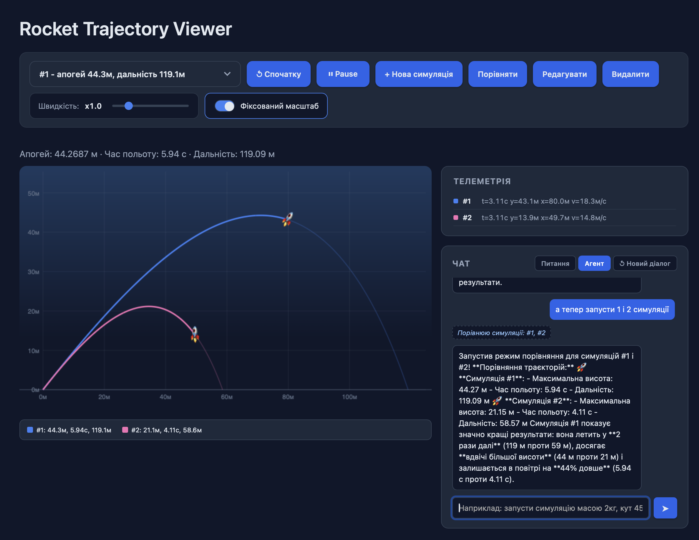
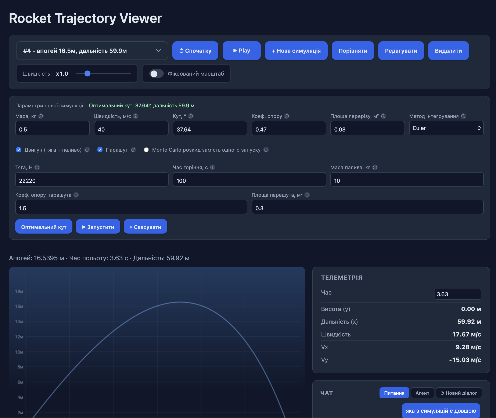
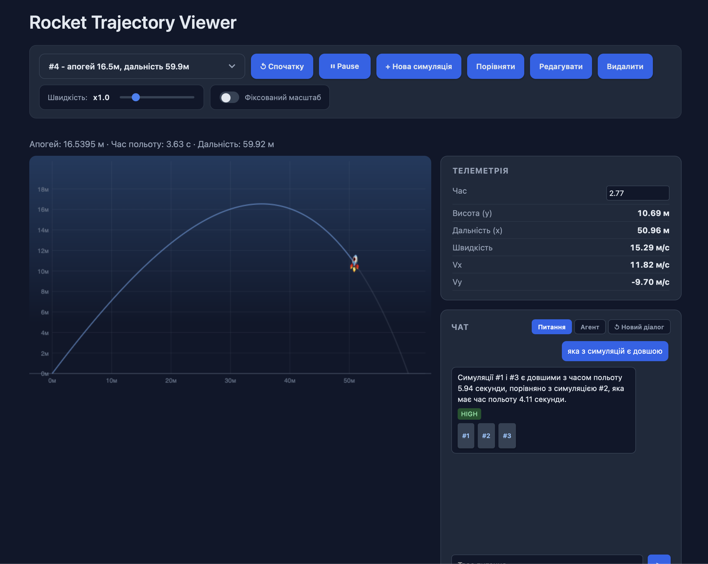
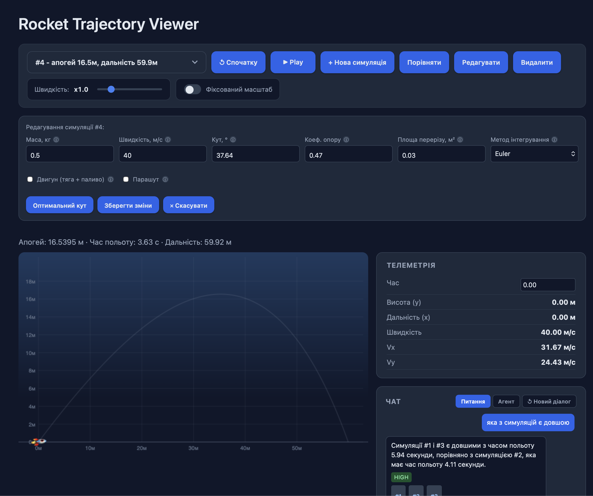

# Rocket Trajectory API

*Also available in [English](README.md).*

> 🔗 Живий сайт: **[rocket-projection.onrender.com](https://rocket-projection.onrender.com)** — сервіс на безкоштовному плані Render засинає після 15 хв бездіяльності, тож перше відкриття може зайняти до хвилини.

Бекенд, що симулює політ ракети з опором повітря, і шар над ним, який дозволяє питати про ці дані природною мовою та керувати симуляціями через AI-агента. Почалось як звичайна фізична задача — порахувати траєкторію кинутого під кутом тіла — а виросло в невеликий, але закінчений стек: async API, база даних, векторний пошук, чат-агент із tool use і власний canvas-візуалізатор без жодного фронтенд-фреймворка.

## Скріншоти

| | |
|---|---|
|  |  |
| **Порівняння** — кілька траєкторій одночасно, агент сам активує режим і коментує різницю | **Нова симуляція** — двигун, парашут, RK4/Euler, пошук оптимального кута прямо з форми |
|  |  |
| **Телеметрія і RAG** — драг по траєкторії, і чат-режим «Питання» з confidence-беджем та посиланнями на симуляції | **Редагування** — та сама форма, але перераховує вже існуючу симуляцію на місці (той самий id), а не створює нову |

## Що вміє

- Рахує траєкторію ракети з опором повітря двома методами інтегрування (Euler і RK4), опційно з двигуном (тяга, час горіння, витрата палива) і парашутом, що розкривається на апогеї.
- Шукає кут запуску з максимальною дальністю. Без опору повітря відповідь завжди 45°, зі спротивом повітря формули вже нема — кут шукається чисельно, golden-section search'ем.
- Рахує Monte Carlo розкид приземлення: прогонить той самий запуск сотні разів з невеликим шумом на кут і швидкість і показує, наскільки розкидаються точки приземлення.
- Відповідає на питання про минулі симуляції природною мовою (RAG: пошук по векторній базі ChromaDB → структурована відповідь від Claude).
- Дає AI-агенту доступ до інструментів — запустити симуляцію, порівняти кілька, знайти оптимальний кут — з памʼяттю діалогу і стрімінгом відповіді в реальному часі.
- Показує все це у власному візуалізаторі на канвасі: анімація польоту, перетягування точки на траєкторії мишкою, порівняння кількох запусків одночасно, форма створення нової симуляції прямо в інтерфейсі.

## Стек

- **Backend:** FastAPI (async), SQLAlchemy 2.0 (async), SQLite локально / Postgres у продакшені
- **AI/ML:** Claude API (Anthropic SDK, streaming + tool use), ChromaDB (embeddings — вбудований ONNX-варіант all-MiniLM-L6-v2, без torch), Instructor (structured output поверх Pydantic v2)
- **Frontend:** чистий JS + HTML5 Canvas, без фреймворків

## Структура

```
app/
├── main.py                # FastAPI app, усі ендпоінти
├── models.py               # SQLAlchemy модель Simulation
├── schemas.py               # Pydantic схеми (request/response)
├── database.py               # async engine, сесії
├── config.py                  # pydantic-settings, читає .env
├── simulation_service.py       # обгортка над фізикою (physics/)
├── rag_service.py                # embeddings + ChromaDB + /ask (RAG)
└── agent.py                       # tool-use агент: памʼять діалогу + NDJSON-стрімінг

physics/
├── rocket.py               # клас Rocket
└── environment.py           # клас SimulationEnvironment — інтегрування руху з опором повітря

static/
├── index.html               # UI: canvas-візуалізатор + телеметрія + чат
├── style.css
└── script.js                  # анімація, drag, порівняння симуляцій, чат

tests/
├── test_physics.py           # фізика: апогей без опору, опір, двигун, парашут, Euler vs RK4
├── test_optimization.py       # пошук кута, Monte Carlo розкид
└── test_api.py                  # ендпоінти: create/list/get/delete/update, optimal-angle, dispersion
```

## API

- `POST /simulate` — нова симуляція (з опційним двигуном/парашутом/RK4)
- `GET /simulations`, `GET /simulations/{id}` — список і деталі
- `PUT /simulations/{id}` — перерахувати з новими параметрами (той самий id)
- `DELETE /simulations/{id}` — видалення (з SQL і з ChromaDB)
- `POST /simulate/optimal-angle` — знайти кут з максимальною дальністю
- `POST /simulate/dispersion` — Monte Carlo розкид приземлення (тільки аналіз, у БД не зберігається)
- `POST /ask` — питання природною мовою про існуючі симуляції (RAG)
- `POST /agent/chat`, `POST /agent/chat/stream` — той самий агент з tool use, другий варіант стрімить NDJSON: токени відповіді плюс подія на кожен виклик інструменту

Повна інтерактивна документація — на `/docs`.

## Запуск локально

Потрібен [uv](https://docs.astral.sh/uv/).

```bash
uv sync
cp .env.example .env   # і вписати свій ANTHROPIC_API_KEY
uv run uvicorn app.main:app --reload
```

Відкрити http://127.0.0.1:8000/static/index.html (візуалізатор) або http://127.0.0.1:8000/docs (Swagger).

## Запуск у Docker

```bash
docker compose up --build
```

Потрібен `.env` з `ANTHROPIC_API_KEY` у корені проєкту. Без `DB_*` у `.env` контейнер так само працює на локальному SQLite (`rocket.db` і `chroma_data/` підключені як volume, щоб дані не губились при перезапуску).

## База даних: SQLite локально, Postgres у продакшені

Без `DB_HOST` у налаштуваннях застосунок сам падає на локальний файл `rocket.db` — для розробки не треба нічого піднімати окремо. Якщо `DB_HOST` заданий (у продакшені — вказує на безкоштовний Postgres від Supabase чи Neon), він переходить на нього через `asyncpg`. Схему застосунок піднімає сам при старті (без повноцінного Alembic — легка ad-hoc міграція в `app/database.py`, що працює з обома діалектами).

ChromaDB (векторний індекс для `/ask`) все одно живе на локальному диску контейнера й не переживає редеплой на Render (free-план без постійного диска) — але це не проблема: при кожному старті застосунок перечитує всі симуляції з Postgres і перебудовує індекс наново (`reindex_all` в `rag_service.py`). Тобто джерело правди — завжди Postgres, Chroma можна втрачати й відновлювати.

## Деплой

Задеплоєно на [Render](https://render.com) як Docker Web Service, той самий підхід, що й в інших моїх проєктах (напр. [CoffeeTime](https://github.com/DAROLEND/CoffeeTime)) — через `render.yaml` (Blueprint):

1. Завести безкоштовний Postgres на [Supabase](https://supabase.com) чи [Neon](https://neon.tech) і взяти звідти host/port/name/user/password.
2. Запуштити репозиторій на GitHub (готово).
3. У Render: **New → Blueprint**, підключити цей репозиторій — Render сам прочитає `render.yaml` і підніме сервіс.
4. У налаштуваннях сервіса вписати секрети `ANTHROPIC_API_KEY` і `DB_HOST`/`DB_NAME`/`DB_USER`/`DB_PASS` (навмисно не в `render.yaml`, щоб не світилися в git).
5. Увімкнути GitHub App для автодеплою на пуш: [github.com/settings/installations](https://github.com/settings/installations) → Render → додати цей репозиторій.

Якщо `DB_*` не задати, сервіс все одно підніметься — просто на локальному SQLite-файлі контейнера, а тоді дані вже дійсно скидаються при кожному редеплої (free-план Render без постійного диска).

## Тести

```bash
uv run pytest
```

27 тестів: фізика (апогей без опору звіряється з аналітичною формулою, вплив опору/двигуна/парашута, узгодженість Euler і RK4), оптимізація (знайдений кут не гірший за 45°, розкид росте з шумом) і API (усі ендпоінти на окремій тестовій SQLite-базі, реальні `rocket.db` і ChromaDB-індекс не чіпаються).

## Чесно про обмеження

- `confidence` у `/ask` — це самооцінка моделі (high/medium/low), а не метрика, привʼязана до реальної відстані ембеддінгів. Модель не завжди адекватно оцінює власну впевненість — правильний фікс прив'язати її до retrieval-score, але пороги для цього треба тюнити на реальних даних, тож поки лишив як є.
- Памʼять діалогу агента живе в оперативній памʼяті процесу, без персистентності. Для демо достатньо, але не переживе перезапуск сервера чи кілька інстансів.
- Ad-hoc міграція в `database.py` вміє тільки додавати нові nullable-колонки — для зміни типу колонки чи чогось складнішого знадобиться справжній Alembic (він у залежностях, але не підключений).
- Free-план Render дає 512MB RAM — навіть після переходу з `sentence-transformers`/`torch` на легший ONNX-embedding з ChromaDB пік памʼяті під навантаженням впритул до ліміту (~460MB виміряно локально під кількома запитами підряд). Для демо-навантаження цього вистачає, але сплеск паралельних запитів теоретично може OOM-нути процес.
- Двигун — спрощена модель (стала тяга + лінійне вигоряння маси), без рівняння Ціолковського й питомого імпульсу. Парашут розкривається миттєво в момент початку падіння, без затримки. Розкид Monte Carlo — тільки вздовж дальності, без бокового вітру.
- Ендпоінти публічні, без автентифікації — навчальний проєкт, не production.

## Як це писалось

Архітектуру, фізику й тестові сценарії продумував сам, а писав у парі з Claude Code — AI бере на себе рутину (boilerplate, ендпоінти, тести), я перевіряю логіку і приймаю рішення. Для позиції AI Engineer це, думаю, і є частина навички — вміти працювати з AI-інструментами як з парним програмістом, а не просто знати теорію про LLM.
